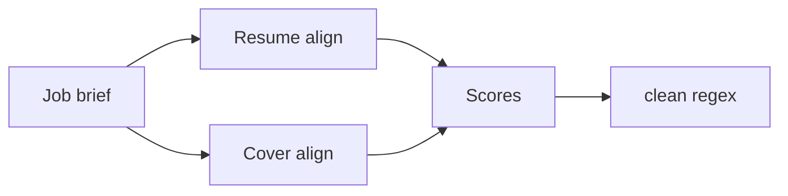

# AI engineering notes

## Tool calling and structured outputs

- Specialist steps use the OpenAI Agents SDK with **structured outputs** (Pydantic models) at boundaries so downstream code never parses free-form prose.
- The orchestrator stays **manager-style**: sub-agents are exposed via `Agent.as_tool()` so traces stay predictable and the pipeline remains explicit (versus open-ended handoffs).

## MCP (Model Context Protocol)

`alignai/agents/mcp.py` exposes `optional_mcp_servers`, intended to register:

1. **Filesystem MCP** (`@modelcontextprotocol/server-filesystem`) scoped to the AlignAI data directory — optional reads/writes for generated artifacts.
2. **Fetch MCP** (`mcp-server-fetch`) — optional plain-HTTP retrieval for job pages.

Both require Node.js/`npx` on `PATH`. When unavailable, the context manager yields an **empty list** and the app relies on built-in **function tools** (`httpx` + trafilatura + Playwright fallback) with no user-visible failure. Production bundles may wire concrete `MCPServerStdio` instances here.

## Libraries and trade-offs

| Choice | Rationale |
| --- | --- |
| OpenAI Agents SDK | First-class tools, structured outputs, tracing hooks |
| OpenAI-compatible HTTP | Works with OpenAI, OpenRouter, Ollama, vLLM, etc. |
| trafilatura + Playwright | Fast extract-first; headless browser only when needed |
| Chromium PDF (`page.pdf`) | Single browser stack for scrape + PDF render; avoids WeasyPrint native deps in installers |

## Multi-agent flow

High-level sequence: **job context → parallel resume + cover alignment → parallel ATS + match scoring → deterministic text cleanup** before persistence/render.

Manager-style orchestration keeps cost and trace verbosity lower than unconstrained handoffs; handoffs remain available if we later add “ask the user” branches.

## Deterministic post-processing

All LLM-produced strings pass through `infra.text_cleanup.clean()` so punctuation and whitespace are normalized before SQLite/PDF (em-dash rule, collapsed spaces, etc.).

## Evaluation / future work

Structured fixtures (`tests/fixtures/recorded_llm/`) support regression testing without live models. A fuller eval harness (golden alignments, rubric scoring) is future scope.
